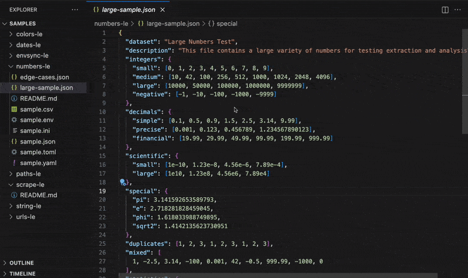
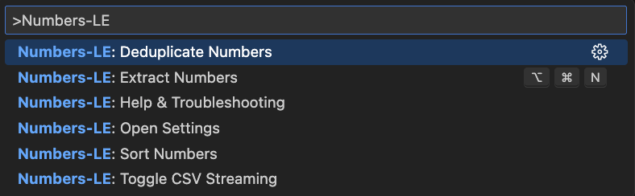

<p align="center">
  
</p>
<h1 align="center">Numbers-LE: Zero Hassle Number Extraction</h1>
<p align="center">
  <b>Extract 1.5M numbers per second</b> • <b>100x faster than manual searching</b><br/>
  <i>JSON, YAML, CSV, TOML, INI, ENV</i>
</p>

<p align="center">
  <a href="https://open-vsx.org/extension/OffensiveEdge/numbers-le">
    
  </a>
  <a href="https://marketplace.visualstudio.com/items?itemName=nolindnaidoo.numbers-le">
    
  </a>
</p>

<p align="center">
  
  
  
  
</p>

---

<p align="center">
  
</p>

<p align="center">
  
</p>

---

## ⚡ See It In Action

**Before**: Manually copying numbers from a 1,000-line JSON file (30 minutes)

```json
{
  "revenue": 1250000,
  "profit": 340000,
  "expenses": [125000, 89000, 56000]
  // ... 200 more values buried in nested objects
}
```

**After**: One command extracts all 203 numbers with stats in 0.2 seconds

```
Numbers: 203 total
Sum: 15,234,567
Average: 75,023
Min: 1,200 | Max: 1,250,000
Median: 45,000
```

**Time Saved**: 30 minutes → 1 second ⚡

---

## ✅ Why Numbers-LE?

- **1.5M numbers per second** - 100x faster than manual searching
- **Zero Config** - Install → Press `Cmd+Alt+N` → Get stats instantly
- **Battle-Tested** - 171 unit tests, 95% coverage, zero critical vulnerabilities
- **Security-Hardened** - 42 tests prevent CSV formula injection, DDE attacks, SQL/XSS vectors

Perfect for data validation, config audits, and financial analysis.

---

## 🙏 Thank You

If Numbers-LE saves you time, a quick rating helps other developers discover it:  
⭐ [Open VSX](https://open-vsx.org/extension/OffensiveEdge/numbers-le) • [VS Code Marketplace](https://marketplace.visualstudio.com/items?itemName=nolindnaidoo.numbers-le)

---

### Key Features

- **Statistical analysis** - Count, sum, average, min, max, median, mode, std dev
- **Automatic cleanup** - Sort, dedupe, and filter by ranges
- **6 file formats** - JSON, YAML, CSV, TOML, INI, ENV
- **Smart filtering** - Excludes IDs, version numbers, non-data noise
- **CSV streaming** - Handle 500MB+ files without memory issues
- **13 languages** - English, Chinese, German, Spanish, French, Indonesian, Italian, Japanese, Korean, Portuguese, Russian, Ukrainian, Vietnamese

## 🚀 More from the LE Family

- **[String-LE](https://open-vsx.org/extension/OffensiveEdge/string-le)** - Extract user-visible strings for i18n and validation • [VS Code Marketplace](https://marketplace.visualstudio.com/items?itemName=nolindnaidoo.string-le)
- **[EnvSync-LE](https://open-vsx.org/extension/OffensiveEdge/envsync-le)** - Keep .env files in sync with visual diffs • [VS Code Marketplace](https://marketplace.visualstudio.com/items?itemName=nolindnaidoo.envsync-le)
- **[Paths-LE](https://open-vsx.org/extension/OffensiveEdge/paths-le)** - Extract file paths from imports and dependencies • [VS Code Marketplace](https://marketplace.visualstudio.com/items?itemName=nolindnaidoo.paths-le)
- **[URLs-LE](https://open-vsx.org/extension/OffensiveEdge/urls-le)** - Audit API endpoints and external resources • [VS Code Marketplace](https://marketplace.visualstudio.com/items?itemName=nolindnaidoo.urls-le)
- **[Scrape-LE](https://open-vsx.org/extension/OffensiveEdge/scrape-le)** - Validate scraper targets before debugging • [VS Code Marketplace](https://marketplace.visualstudio.com/items?itemName=nolindnaidoo.scrape-le)
- **[Colors-LE](https://open-vsx.org/extension/OffensiveEdge/colors-le)** - Extract and analyze colors from stylesheets • [VS Code Marketplace](https://marketplace.visualstudio.com/items?itemName=nolindnaidoo.colors-le)
- **[Dates-LE](https://open-vsx.org/extension/OffensiveEdge/dates-le)** - Extract temporal data from logs and APIs • [VS Code Marketplace](https://marketplace.visualstudio.com/items?itemName=nolindnaidoo.dates-le)

## 💡 Use Cases

- **Financial Analysis** - Extract revenue, profit, and growth metrics from JSON/CSV for quick validation
- **Config Validation** - Pull timeouts, limits, and thresholds from YAML/TOML/INI for auditing
- **Performance Monitoring** - Analyze CPU, memory, and response times from logs and metrics files
- **Data QA** - Get instant statistics (avg, median, outliers) on numeric datasets

## 🚀 Quick Start

1. Install from [Open VSX](https://open-vsx.org/extension/OffensiveEdge/numbers-le) or [VS Code Marketplace](https://marketplace.visualstudio.com/items?itemName=nolindnaidoo.numbers-le)
2. Open any supported file type (`Cmd/Ctrl + P` → search for "Numbers-LE")
3. Run Quick Extract (`Cmd+Alt+N` / `Ctrl+Alt+N` / Status Bar)

## ⚙️ Configuration

- `numbers-le.openResultsSideBySide` – Open to the side
- `numbers-le.csv.streamingEnabled` – Toggle CSV streaming
- `numbers-le.dedupeEnabled` – Auto-dedupe numbers
- `numbers-le.sortEnabled` – Auto-sort output
- `numbers-le.analysis.enabled` – Enable statistical analysis
- `numbers-le.analysis.includeStats` – Include detailed statistics
- **Safety Guards** – File size warnings & thresholds
- **Notification Levels** – Control verbosity and alerts

## ⚡ Performance

<!-- PERFORMANCE_START -->

Numbers-LE is built for speed and handles files from 100KB to 30MB+. See [detailed benchmarks](docs/PERFORMANCE.md).

| Format   | File Size | Throughput | Duration | Memory | Tested On     |
| -------- | --------- | ---------- | -------- | ------ | ------------- |
| **JSON** | 0.13MB    | 1218182    | ~1.1     | < 1MB  | Apple Silicon |
| **JSON** | 1.31MB    | 1593824    | ~8.42    | < 1MB  | Apple Silicon |
| **JSON** | 6.55MB    | 1356652    | ~49.46   | < 1MB  | Apple Silicon |
| **CSV**  | 0.5MB     | 1232136    | ~15.87   | < 1MB  | Apple Silicon |
| **CSV**  | 3MB       | 1548819    | ~75.77   | ~13MB  | Apple Silicon |
| **CSV**  | 10MB      | 1204916    | ~324.64  | < 1MB  | Apple Silicon |
| **ENV**  | 5K lines  | 1,561,687  | ~19.21   | < 1MB  | Apple Silicon |

**Real-World Performance**: Tested with actual data up to 30MB (practical limit: 1MB warning, 10MB error threshold)  
**Performance Monitoring**: Built-in real-time tracking with configurable thresholds  
**Full Metrics**: [docs/PERFORMANCE.md](docs/PERFORMANCE.md) • Test Environment: macOS, Bun 1.2.22, Node 22.x

<!-- PERFORMANCE_END -->

## 🧩 System Requirements

**VS Code** 1.70.0+ • **Platform** Windows, macOS, Linux  
**Memory** 500MB recommended for large files

## 🔒 Privacy

100% local processing. No data leaves your machine. Optional logging: `numbers-le.telemetryEnabled`

## 🌍 Language Support

**13 languages**: English, German, Spanish, French, Indonesian, Italian, Japanese, Korean, Portuguese (Brazil), Russian, Ukrainian, Vietnamese, Chinese (Simplified)

## 🔧 Troubleshooting

**Not detecting numbers?**  
Ensure file is saved with supported extension (.json, .yaml, .csv, .toml, .ini, .env)

**Large files slow?**  
Enable CSV streaming: `numbers-le.csv.streamingEnabled: true`

**Need help?**  
Check [Issues](https://github.com/OffensiveEdge/numbers-le/issues) or enable logging: `numbers-le.telemetryEnabled: true`

## ❓ FAQ

**What numbers are extracted?**  
Integers, floats, percentages, currencies (excludes IDs, version numbers)

**Can I get statistics?**  
Yes, enable `numbers-le.analysis.enabled: true` for avg, median, std dev, outliers

**Max file size?**  
Up to 500MB with CSV streaming. Practical limit: 10MB for other formats

**CSV streaming?**  
Enable `numbers-le.csv.streamingEnabled: true` to process large CSVs in chunks

## 📊 Testing

**171 unit tests** • **95% function coverage, 80% line coverage**  
Powered by Vitest • Run with `bun test --coverage`

### Test Suite Highlights

- **42 security tests** for CSV/ENV/INI injection prevention
- **Comprehensive coverage** of JSON, YAML, CSV, TOML, INI, ENV formats
- **Statistical analysis** validation and edge case handling

---

Copyright © 2025  
<a href="https://github.com/OffensiveEdge">@OffensiveEdge</a>. All rights reserved.
